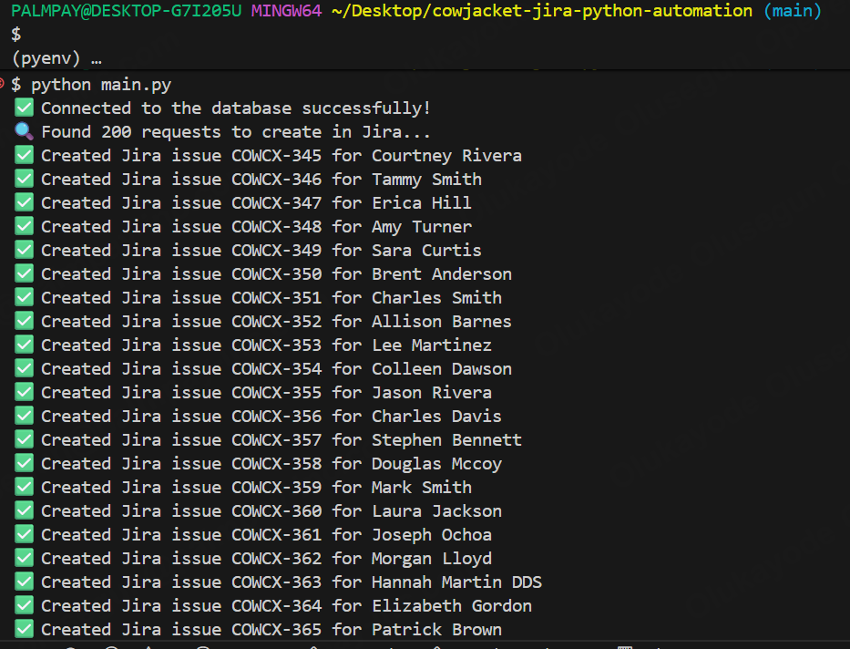

# CowJacket Jira Python Automation 🐮

## 📌 Project Overview
CowJacket Jira Python Automation is a Python-based automation tool designed to streamline the integration between CowJacket’s request tracking system and Jira. The project eliminates the need for manual issue creation and CSV uploads by automating Jira ticket creation, updates, and tracking through API interactions.

## 🚀 Features
- Automatically creates Jira tickets from CowJacket requests database
- Supports Jira REST API integration
- Handles authentication using environment variables (.env)
- Performs automated field mapping (e.g., summary, description, issue type)
- Logs all automation activity for traceability and debugging

## ⚙️ Tech Stack
- **Language:** Python
- **Libraries:** `jira`,`psycopg2`,  `os`, `dotenv`, `json`
- **Platform:** Jira Cloud REST API
- **Version Control:** Git & GitHub

## 🧠 How It Works
1. **Extracts Request Data** from CowJacket database.
2. **Transforms** request details into Jira-compatible JSON payloads.
3. **Loads** the transformed data into Jira via REST API POST requests.
4. **Logs Responses** for success/failure handling.

## 📸 Demo Output
This shows the successfully created Jira issues using the automation script:




## 🔐 Environment Setup
Create a `.env` file in the project root with your database and Jira credentials:

```bash
# Database connection details.
HOST_NAME="your_database_host_name"
DB_USER="your_database_user_name"
DB_NAME="your_database_name"
DB_PASSWORD="your_database_password"
DB_PORT="your_database_port"

# Jira connection details.
JIRA_BASE_URL="https://your-domain.atlassian.net"
JIRA_EMAIL="your_email@example.com"
JIRA_API_TOKEN="your_generated_token"
JIRA_PROJECT_KEY="COWCX"
```

## 🧩 Example Usage
```python
from db_connection import connect_to_db, fetch_requests
from jira_connection import connect_to_jira, create_jira_issue

issue = jira.create_issue(
        project=project_key,
        summary=summary,
        description=description,
        issuetype={"name": "Submit a request or incident"} 
    )
response = create_jira_ticket(issue_data)
print(response.status_code)
```

## 🧾 Logging
All API calls and responses are logged automatically to `automation_log.txt` for audit purposes.

## 🤝 Contributing
Pull requests are welcome! Please open an issue first to discuss changes.

## 🧑‍💻 Author
**Olusegun Olukayode**  
Data and Analytics Engineer | Business Intelligence Analyst | Automation Enthusiast

---
_“Automate the routine. Focus on the impactful.”_

